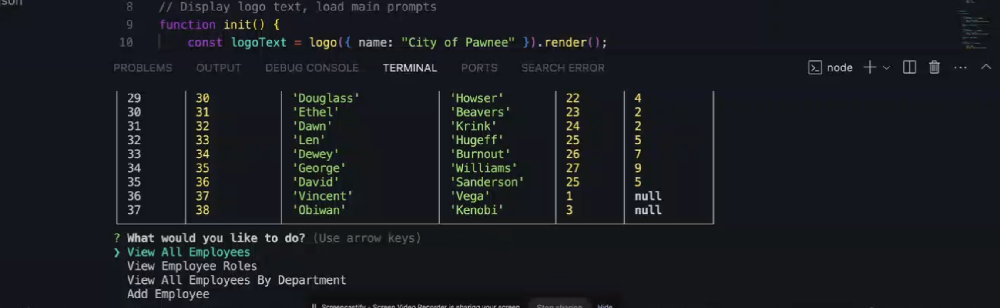

# sql_employee_tracker

# Description

This is an employee Tracker to monitor and update various aspects of employee activities, such as attendance, roles, salary etc.

For:

- Remote monitoring
- Payroll
- Scheduling

## Example

## Links

[GitHub](https://github.com/ParryProgramming)
